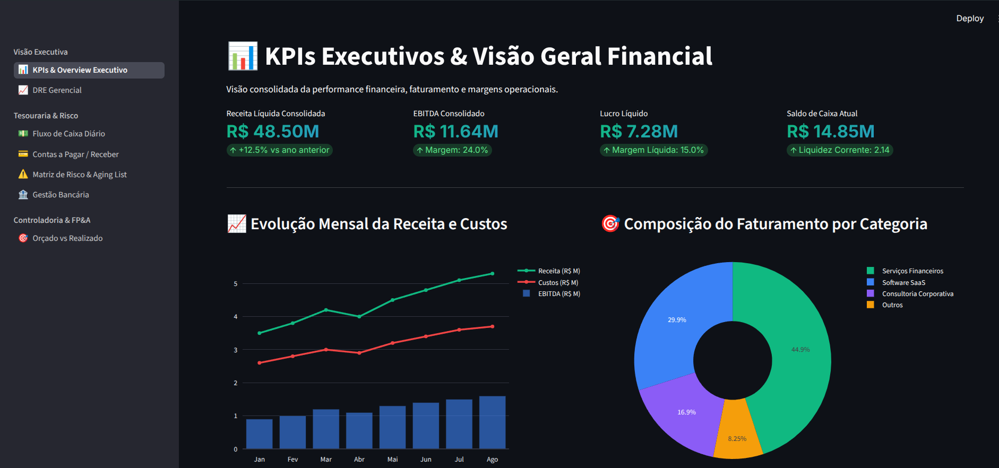

<div align="center">

# 📊 CoreFin Analytics
### Pipeline de Engenharia de Dados & Dashboard Financeiro Corporativo

[](https://fastapi.tiangolo.com/)
[](https://www.postgresql.org/)
[](https://streamlit.io/)
[](https://www.docker.com/)
[](https://www.python.org/)

<br>

> ⚠️ **Aviso de Isenção de Responsabilidade (Disclaimer):** Todos os dados, indicadores financeiros, nomes de empresas e transações presentes neste repositório são **100% fictícios**. Este projeto foi concebido e implementado exclusivamente para fins didáticos, portfólio profissional e demonstração prática de Arquitetura de Engenharia de Dados.

<br>



</div>

---

## 🎯 Objetivo do Projeto

O objetivo principal deste projeto é **demonstrar na prática a implementação de uma solução de Engenharia de Dados e Analytics Financeiro** baseada na **Arquitetura Medalhão (Medallion Architecture)**.

Este repositório foi construído para fins didáticos e de portfólio técnico, exemplificando como estruturar um pipeline completo em **Python** que realiza a ingestão, higienização, transformação e consumo de dados financeiros corporativos distribuídos nas camadas **Bronze**, **Silver** e **Gold** dentro do **PostgreSQL**, disponibilizando os resultados em uma API REST (**FastAPI**) e em um painel web interativo (**Streamlit**).

---

## 🏛️ Arquitetura e Camadas de Dados

O estagiamento e processamento dos dados ocorrem dentro do banco PostgreSQL (`corefin`) dividido em três schemas isolados:

1. **Camada Bronze (`bronze`)**:
   - Recebe a carga inicial de dados brutos (*raw JSON*) referentes ao faturamento, contas a pagar/receber, posições bancárias, DRE e controle orçamentário.
   - Tabelas: `raw_overview`, `raw_contas_pagar`, `raw_contas_receber`, `raw_bancos`, `raw_fluxo_caixa`, `raw_dre`, `raw_centros_custo`, `raw_clientes_criticos`.

2. **Camada Silver (`silver`)**:
   - Aplica regras de limpeza, padronização de tipos de dados, deduplicação, tratamento de valores nulos e criação de flags de controle (`is_pago`, `is_recebido`).
   - Tabelas: `silver_overview`, `silver_contas_pagar`, `silver_contas_receber`, `silver_bancos`, `silver_fluxo_caixa`, `silver_dre`, `silver_centros_custo`, `silver_clientes_criticos`.

3. **Camada Gold (`gold`)**:
   - Agrega os dados em tabelas orientadas a indicadores executivos (KPIs), DRE Gerencial, Fluxo de Caixa Diário, Matriz de Risco (Aging List) e Posição Bancária.
   - Tabelas: `gold_kpis_executivos`, `gold_fluxo_caixa_diario`, `gold_dre_gerencial`, `gold_matriz_risco_aging`, `gold_clientes_criticos`, `gold_gestao_bancaria`.

---

## 📐 Diagrama de Fluxo

```
 +-----------------------------------------------------------------------------------+
 |                             PostgreSQL (Database: corefin)                        |
 |                                                                                   |
 | +-----------------------+   +-----------------------+   +-----------------------+ |
 | |    Schema: bronze     |   |    Schema: silver     |   |     Schema: gold      | |
 | |  (Tabelas Brutas Raw) | ==> |  (Tabelas Limpas)     | ==> | (Agregados & KPIs BI) | |
 | +-----------------------+   +-----------------------+   +-----------------------+ |
 +-----------------------------------------------------------------------------------+
             ^                                                           |
             |                                                           v
  +----------------------+                                   +-----------------------+
  |  FastAPI Backend     |                                   |   Streamlit Web App   |
  |  (Porta 8001)        |                                   |   (Porta 8501)        |
  |  - REST API          |                                   |   - st.navigation     |
  |  - Pipeline Medalhão |                                   |   - Visualização Plotly |
  +----------------------+                                   +-----------------------+
```

---

## 🛠️ Tecnologias Utilizadas

| Componente | Tecnologia | Função no Projeto |
| :--- | :--- | :--- |
| **Data Warehouse** | PostgreSQL 16 | Armazenamento relacional e estagiamento nas camadas Bronze, Silver e Gold. |
| **Backend / API** | FastAPI + Uvicorn | Servidor REST e orquestração do pipeline de transformação Python. |
| **Frontend / Dashboard** | Streamlit + Plotly | Interface web interativa com navegação multi-páginas via `st.navigation`. |
| **Orquestração / Infra** | Docker & Docker Compose | Containerização dos serviços para execução local reproduzível. |
| **Linguagem Base** | Python 3.12 | Ingestão, manipuladores `psycopg2` / `pandas` e rotas da aplicação. |

---

## 📂 Estrutura do Repositório

```text
automacao_financeiro/
├── app.py                      # Ponto de entrada do Streamlit (st.navigation)
├── Dockerfile                  # Especificação da imagem Python da aplicação
├── docker-compose.yml          # Definição dos contêineres (Postgres, Backend e Streamlit)
├── requirements.txt            # Dependências Python do projeto
├── README.md                   # Documentação técnica do repositório
│
├── backend/                    # Código-fonte da API FastAPI
│   ├── main.py                 # Inicializador do servidor e evento de startup
│   └── routers/
│       └── finance.py          # Endpoints HTTP REST
│
├── data/                       # Dataset em JSON com os dados financeiros de entrada
│   └── finance_corporate_data.json
│
├── postgres/                   # Scripts SQL de inicialização do banco
│   └── init-scripts/
│       └── 01-init-databases.sql
│
├── scripts/                    # Scripts Python do Pipeline Medalhão
│   ├── seed_bronze.py          # Ingestão de dados brutos na camada Bronze
│   └── run_medallion.py        # Execução das transformações Silver e Gold
│
├── utils/                      # Funções utilitárias
│   └── db_connection.py        # Módulo de conexão com o PostgreSQL
│
└── views/                      # Páginas de visões do Streamlit
    ├── kpis_executivos.py
    ├── dre_gerencial.py
    ├── fluxo_caixa.py
    ├── contas_pagar_receber.py
    ├── risco_credito.py
    ├── gestao_bancaria.py
    └── centros_custo.py
```

---

## 🌐 Serviços e Portas de Acesso

Ao iniciar a aplicação, os seguintes serviços ficarão disponíveis:

| Serviço | URL de Acesso | Descrição |
| :--- | :--- | :--- |
| **Streamlit Dashboard** | `http://localhost:8501` | Interface visual de relatórios e indicadores. |
| **FastAPI Swagger Docs** | `http://localhost:8001/docs` | Documentação interativa da API REST. |
| **PostgreSQL Database** | `localhost:5432` | Banco `corefin` (User: `postgres` / Pass: `postgres_password`). |

---

## 🚀 Como Executar Localmente

### Pré-requisitos
- **Docker** e **Docker Compose** instalados.

### Passo a Passo

```bash
# 1. Clonar o repositório
git clone https://github.com/LucasPPontes/corefin_analytics.git
cd corefin_analytics

# 2. Iniciar os serviços via Docker Compose
docker-compose up -d --build

# 3. (Opcional) Disparar o pipeline Medalhão via API
curl -X POST http://localhost:8001/api/etl/run
```

---

## 📄 Licença

Este projeto é disponibilizado sob a licença [MIT](LICENSE).
